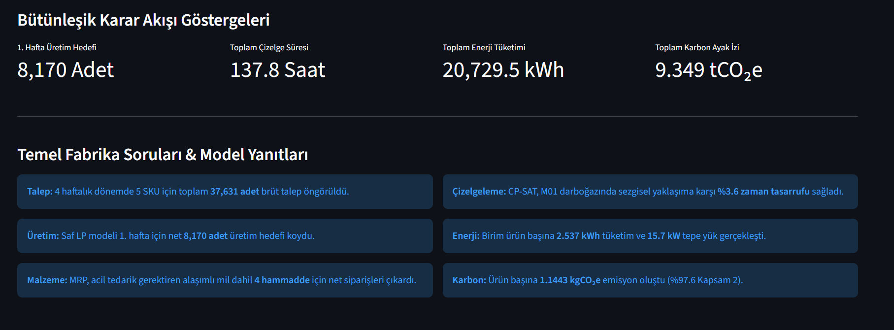
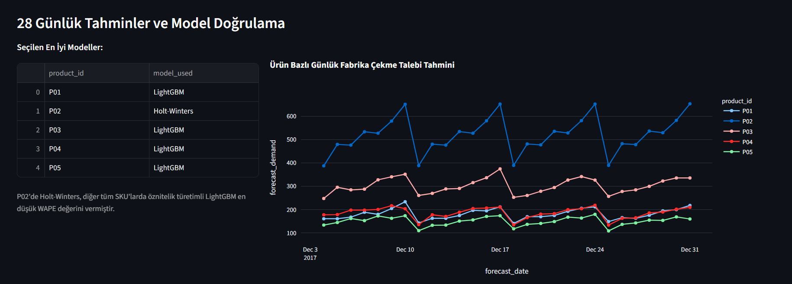
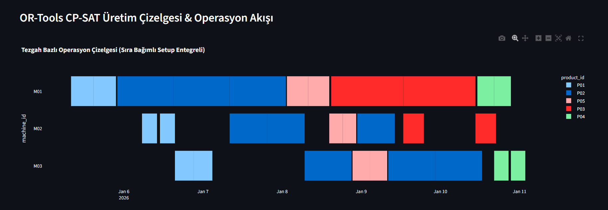
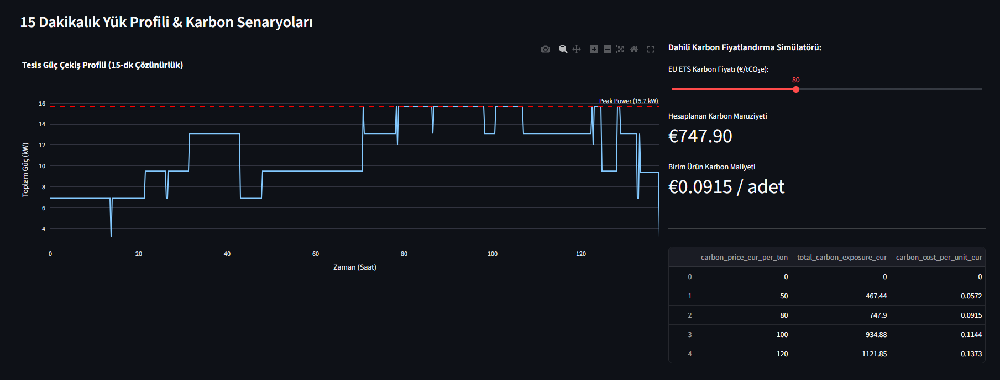

# 🏭 Factory Decision Intelligence Platform
**Uçtan Uca Endüstriyel Karar Destek, Hiyerarşik Planlama ve Sürdürülebilirlik Platformu**


-orange?style=for-the-badge)


---

## 📌 Proje Özeti
Bu platform; perakende satış noktalarından gelen çok kanallı stok çekme taleplerini konsolide ederek operasyonel seviyede detaylı tezgâh çizelgelemesine ve kurumsal sürdürülebilirlik analitiğine dönüştüren **uçtan uca bir Endüstriyel Karar Zekâsı (Decision Intelligence) mimarisidir**.

Klasik tahminleme veya basit çizelgeleme projelerinden farklı olarak; **Hax & Meal hiyerarşik planlama prensiplerini**, **zaman fazlı malzeme ihtiyaç patlatmasını (MRP-I)**, **sıra bağımlı hazırlık süreli (changeover) kısıt programlamasını (CP-SAT)** ve **GHG Protocol uyumlu dinamik yük profillemesini** tek bir ilişkisel veri modelinde (`SQLite`) bütünleştirir.
## 🖥️ Karar Destek Panosu Önizlemesi

| 📊 Yönetici Karar Özeti | 📈 Talep Tahmini & Model Kıyaslama |
|:---:|:---:|
|  |  |
| *Bütünleşik KPI'lar ve 7 Fabrika Sorusu* | *WAPE Kıyaslaması ve 28 Günlük Tahminler* |

| ⏱️ CP-SAT Tezgah Çizelgesi (Gantt) | 🌱 Yük Profili & Karbon Simülasyonu |
|:---:|:---:|
|  |  |
| *M01 Darboğaz Yönetimi ve Sıra Bağımlı Setup* | *15.7 kW Tepe Güç & EU ETS Fiyat Slider'ı* |

---

---

## 🏗️ Bütünleşik Karar Akışı Mimarisi
```
[Ham Satış Verisi (Kaggle)]
         │
         ▼ (Konsolidasyon: D_i,t = Σ Sales)
[Veri Ön İşleme & SQLite (factory.db)]
         │
         ▼ (28 Günlük Ufuk: WAPE, RMSE, Bias Kıyaslaması)
[Talep Tahminleme: LightGBM vs. Holt-Winters]
         │
         ▼ (Haftalık Kova / Weekly Buckets: W1-W4)
[Hax & Meal Taktik Planlama (Sürekli LP & Gölge Fiyat Analizi)]
         │
         ▼ (Level 2: Talep Oransal SKU Ayrıştırma)
[Malzeme İhtiyaç Planlaması (MRP-I & Dinamik Emniyet Stoğu)]
         │
         ▼ (Partileme / Lot-Sizing: 1 Hafta Ufuk)
[Detaylı Çizelgeleme: Google OR-Tools CP-SAT (Makespan Minimizasyonu)]
         │
         ▼ (15 Dakikalık Yük Profili & GHG Protocol)
[Enerji & Kurumsal Karbon Analitiği (Scope 1 & 2 + EU ETS Simülasyonu)]
         │
         ▼
[Streamlit & Plotly İnteraktif Yönetici Karar Panosu]
```

---

## 🔬 Matematiksel Modeller & Mühendislik Metotları

### 1. Talep Tahminleme & Model Kıyaslama (Forecasting Benchmark)
* **Yarışan Modeller:** Naive, Seasonal Naive, Moving Average, Holt-Winters (Exponential Smoothing) ve LightGBM (Gecikme ve kayan istatistik öznitelikleriyle).
* **Seçim Kriteri:** En düşük WAPE (Weighted Absolute Percentage Error).
* **Endüstriyel Çıkarım:** Runner SKU niteliğindeki P02 ürününde **Holt-Winters (%6.81 WAPE)**, LightGBM'i (%8.01 WAPE) geride bırakmıştır. Şartname doğrultusunda her ürün için en düşük WAPE değerine sahip model dinamik olarak seçilmiştir.

### 2. Hiyerarşik Taktik Planlama (Level 1: Continuous LP)
* **Formülasyon:** Hax & Meal prensipleri uyarınca ürün aileleri (`FAM_A`, `FAM_B`) bazında sürekli doğrusal programlama (Continuous LP) çözülmüştür.
* **Gölge Fiyat (Shadow Price) Analizi:** Kapasite kısıtının dual değeri 2, 3 ve 4. haftalarda **-675 $/saat** çıkarak fazla mesai birim maliyetiyle ($1.5 \times 450$) kusursuz örtüşmüş ve darboğazın ekonomik maruziyetini doğrulamıştır.

### 3. Zaman Fazlı Malzeme İhtiyaç Planlaması (MRP-I)
* **Ürün Ağacı (BOM) Patlatması:** SKU üretim hedefleri doğrudan 4 hammadde için brüt ihtiyaca dönüştürülmüştür.
* **Dinamik Emniyet Stoğu:** %95 servis seviyesi ($z = 1.65$) ile $SS = z \cdot \sigma_d \sqrt{L}$ formülü üzerinden hesaplanmıştır.
* **Tedarik Ötelemesi & Erken Uyarı:** 12 günlük tedarik süresi olan `RAW_ALLOY_ROD` için sistem geçmişe dönük (-1. Hafta) acil sipariş ihtiyacını tespit etmiştir.

### 4. Kısıt Programlama ile Çizelgeleme (Google OR-Tools CP-SAT)
* **Kısıtlar:** Operasyon öncelikleri (Precedence), makine çakışmazlığı (No-overlap) ve tezgah bazlı sıra bağımlı hazırlık matrisi (Sequence-dependent setup).
* **Benchmark:** Sezgisel FCFS yaklaşımının 8.578 dakikalık Makespan değerine karşı CP-SAT **8.265 dakika (%3.6 süre tasarrufu)** elde etmiştir.
* **Darboğaz Tespiti:** M01 torna tezgahının 1. haftadaki net iş yükü 131.5 saat olarak hesaplanmış, 2 vardiya tavanını (112 saat) aşan 25.8 saatlik darboğaz için 3. vardiya kararı önerilmiştir.

### 5. Enerji & Karbon Analitiği (GHG Protocol & EU ETS)
* **Enerji Ayrıştırması:** $E_{total} = E_{processing} + E_{setup} + E_{idle}$ formülüyle toplam 20.729,5 kWh enerji hesaplanmıştır (Birim tüketim: 2.537 kWh/adet).
* **Tepe Güç (Peak kW):** 15 dakikalık yük profilinde ulaşılan **15.7 kW**, 3 tezgahın eşzamanlı tam güç çektiği pik periyotları ortaya koymuştur.
* **Karbon Maruziyeti:** Toplam 9.35 tCO₂e emisyonun %97.6'sının Kapsam 2 (elektrik) kaynaklı olduğu kanıtlanmış; EU ETS karbon tahsisat fiyat senaryoları (€0–€120/tCO₂e) modellenmiştir.

---

## 🚀 Kurulum ve Çalıştırma

### 1. Ortamı Hazırlama
```bash
git clone [https://github.com/AliUmutKazak/python-portfolio-starter.git](https://github.com/AliUmutKazak/python-portfolio-starter.git)
cd python-portfolio-starter
conda create -n factory-env python=3.11 -y
conda activate factory-env
pip install pandas numpy lightgbm statsmodels pulp ortools streamlit plotly
```

### 2. Analitik Hattı (Pipeline) Çalıştırma
```bash
python setup_project.py
python src/data/preprocessing.py
python src/data/build_database_and_eda.py
python src/forecasting/train_forecast.py
python src/planning/aggregate_planning.py
python src/inventory/bom_mrp.py
python src/scheduling/schedule_cpsat.py
python src/energy/energy_analytics.py
python src/carbon/carbon_analytics.py
```

### 3. Karar Destek Panosunu Başlatma
```bash
streamlit run dashboard/app.py
```

---

## 🛠️ Teknoloji Yığını
* **Veri & Depolama:** Python, Pandas, NumPy, SQLite3
* **Tahmin & ML:** LightGBM, Statsmodels (Holt-Winters), Scikit-learn
* **Yöneylem Araştırması:** PuLP (CBC Solver), Google OR-Tools (CP-SAT Solver)
* **Arayüz & Görselleştirme:** Streamlit, Plotly Express & Graph Objects
* **Sürdürülebilirlik:** GHG Protocol Kurumsal Standardı, EU ETS Senaryo Analizi